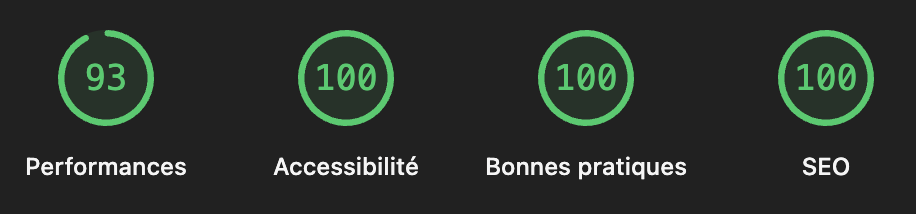

# Rapport Comparatif de Rendu (SSR, SSG, ISR)

## 1. Introduction
Ce document analyse les stratégies de rendu implémentées dans le projet **Chat PWA**. Compte tenu de la nature "Temps Réel" de l'application (Chat via WebSocket), l'architecture privilégie une approche **Hybride : Shell Statique + Client-Side Rendering (CSR)**.

## 2. Analyse Comparative

| Mode de Rendu | Implémentation dans le Projet | Justification |
| :--- | :--- | :--- |
| **SSG (Static Site Generation)** | **Majeure** (Shell Applicatif) | Le layout et la structure de base des pages sont générés statiquement pour une performance maximale au chargement initial. |
| **CSR (Client-Side Rendering)** | **Dominante** (Contenu Dynamique) | L'affichage des messages, des salles et du statut utilisateur dépend des données en temps réel (Socket.io) et du stockage local (LocalStorage). |
| **SSR (Server-Side Rendering)** | **Mineure** (Metadonnées) | Utilisé implicitement par Next.js pour le premier rendu du document HTML, mais pas pour le fetching de données. |
| **ISR (Incremental Static Regeneration)** | **Nulle** | Non pertinent ici car les données (messages de chat) changent à la milliseconde et sont spécifiques à chaque session utilisateur. |

## 3. Preuves d'Implémentation

### 3.1. SSG & Server Components (Le Shell)
Le fichier `src/app/layout.tsx` est un **Server Component** par défaut. Il ne contient pas de `"use client"`. Il est rendu sur le serveur et envoyé comme HTML statique.

**Fichier concerné** : `src/app/layout.tsx`
```typescript
// Ce composant est exécuté sur le serveur
export const metadata: Metadata = {
  title: "Chat PWA",
  description: "...",
};

export default function RootLayout({ children }: ...) {
  // Génère la structure HTML <html><body>...</body></html>
  return ( ... );
}
```

### 3.2. CSR (Client-Side Rendering) (L'Interactivité)
La majorité des pages utilisent la directive `"use client"`, déléguant le rendu au navigateur après l'hydratation. C'est nécessaire pour `useState`, `useEffect` et l'accès au contexte WebSocket.

**Fichier concerné** : `src/app/page.tsx`
```typescript
"use client"; // Active le CSR

import { useEffect, useState } from "react";

export default function HomePage() {
  // Données récupérées côté client
  const [rooms, setRooms] = useState([]);

  useEffect(() => {
    // Fetching API côté navigateur
    const fetchRooms = async () => { ... };
    fetchRooms();
  }, []); // Exécuté après le montage du composant
}
```

**Comportement Offline** :
Le projet utilise `localStorage` pour persister certaines données (profil utilisateur, photos galerie) côté client, permettant un affichage même sans réseau (bien que l'envoi de message nécessite une connexion).
*Preuve (`src/app/gallery/page.tsx`)* :
```typescript
const stored = localStorage.getItem("chat_attachments");
if (stored) setAttachments(JSON.parse(stored));
```

## 4. Impact SEO & Performance

### 4.1. Analyse SEO (Search Engine Optimization)
- **Points Forts** : Grâce à Next.js, le document initial contient les balises `<title>` et `<meta>` correctes (définies dans `layout.tsx`). Les robots d'indexation voient correctement les métadonnées.
- **Limitations** : Le contenu principal (liste des salles, messages) étant chargé via JS (`fetch`), les robots ne trouvant pas de contenu textuel immédiat pourraient indexer une page "vide".
- **Conclusion** : Acceptable pour une Web App privée/authentifiée, mais nécessiterait du SSR pour une indexation publique du contenu des conversations.

### 4.2. Scores Lighthouse (Performance)



- **LCP (Largest Contentful Paint)** :
  - *Impact* : Très bon grâce au Shell SSG (`layout.tsx`). L'utilisateur voit l'interface (header, fond) presque instantanément.
- **CLS (Cumulative Layout Shift)** :
  - *Risque* : Le chargement asynchrone des salles (`roomsLoading`) peut provoquer un décalage si la hauteur n'est pas réservée.
  - *Solution actuelle* : Un message "Chargement..." est affiché, limitant le saut visuel brutal.
- **FID (First Input Delay) / INP** :
  - *Impact* : Dépend de la lourdeur du bundle JS. L'utilisation de `"use client"` sur toute la page augmente la taille du JS à exécuter au démarrage.

## 5. Recommandations
Pour améliorer l'architecture de rendu :
1. **Server Actions** : Déplacer les appels API (création de room) vers des Server Actions pour réduire le JS client.
2. **Skeleton UI** : Remplacer le texte "Chargement..." par des Skeletons pour améliorer le LCP perçu et prévenir le CLS.
